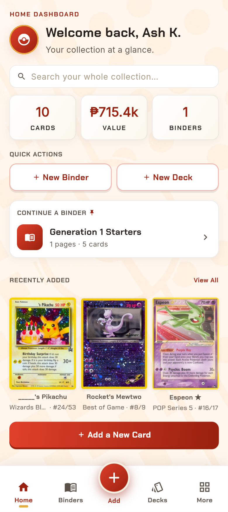

# PokeBinder

> A Pokémon TCG collection manager — track your cards, binders, decks, and wishlist in one place.

## What it does

- Create an account (one account per email), log in, and reset a forgotten password.
- Add cards by searching the Pokémon TCG card catalog (there is no free-form manual entry), then edit or delete them.
- Organize cards into binders and pages; cards removed from a binder stay in **Unassigned Cards**.
- Select several cards at once in All Cards or inside a binder and delete them with the same confirmation.
- Deleting a card also takes it off your trade list, out of your decks, and clears it as your trainer-card favorite.
- Keep a wishlist and a trade list, build decks, and see collection stats and a trainer card.
- View a card's full details with an interactive, drag-to-tilt 3D card.
- See an estimated market value per card in pesos, based on TCGplayer prices and the card's condition.

## Built with

| | |
| --- | --- |
| Framework | Flutter (Dart) |
| State | `setState` per screen, reading in-memory lists (e.g. `PokemonCardData.library`) that mirror Supabase through the repository classes in `lib/services/` |
| Backend | Supabase (email/password auth, Postgres with Row Level Security, and Storage for profile photos) — see [SUPABASE_SETUP.md](SUPABASE_SETUP.md) |
| Card data | [Pokémon TCG API](https://pokemontcg.io), loaded into Supabase with `tools/import_catalog` |
| Other packages | `supabase_flutter`, `google_fonts`, `image_picker`, `audioplayers`, `shared_preferences`, and `device_preview` (lets the app be judged at phone size on a desktop browser) |

## Sound and music

PokeBinder has Pokémon-TCG-flavoured chiptune sound effects and two looping
background themes (a title theme for the login screens and a main theme for the
app). Open **More → Sound & Music** to switch music and effects on or off and set
each volume; on the login screens a speaker button mutes everything. Settings are
remembered between launches.

- Sounds are played through one place, `lib/services/audio_service.dart`
  (`PokeBinderAudio.play(Sfx.cardAdd)`, `PokeBinderAudio.music(MusicTrack.main)`).
- Every Material tap target ticks automatically (`lib/theme/sound_splash_factory.dart`),
  and page changes, dialogs and the card viewer sound via a navigator observer.
- Browsers only allow audio after a first tap, so on web the music starts on
  your first interaction.

## Running it yourself

Requires Flutter (stable channel) with Dart 3.8 or newer.

```bash
flutter pub get
flutter run -d chrome
```

To run the checks: `flutter analyze` and `flutter test`.

### Environment variables

The app talks to Supabase. Follow [SUPABASE_SETUP.md](SUPABASE_SETUP.md) once
to create the tables and configure sign-in. The project URL and anon
(publishable) key are in `lib/config/supabase_config.dart`; they are safe to
publish. Any secret or billable key (e.g. the Supabase secret key or a Pokémon
TCG API key used by the catalog import tool) belongs in `.env` or your terminal
— copy `.env.example`, fill in your own values, and never commit the result.
The import tools read these as environment variables (`SUPABASE_URL`,
`SUPABASE_SECRET_KEY`, `POKEMONTCG_API_KEY`); they do not load `.env` by
themselves, so export them in your terminal first.

## Privacy and secrets

- The app stores an email address, a trainer name, and each user's collection
  data in Supabase. Row Level Security limits every row to its owner.
- Every text box has a maximum length (`lib/config/field_limits.dart`), and the
  database enforces the same limits (`supabase/schema.sql`), so they also apply
  to anyone calling the API directly.
- Only the Supabase URL and anon key are compiled into the web build; both are
  designed to be public. The `service_role` key must never be added.
- Card names and sets (e.g. "Charizard, Base Set") are publicly available card
  information, not personal information.

See [docs/06-security-and-privacy.md](docs/06-security-and-privacy.md) and [docs/07-security-checklist.md](docs/07-security-checklist.md) for the full, dated findings and checklist.

## Project documentation

| Document | What it covers |
| --- | --- |
| [docs/01-proposal.md](docs/01-proposal.md) | Problem, users, scope, data storage, risks |
| [docs/02-mockup.md](docs/02-mockup.md) | All 31 screens with screenshots, the main user journey, changes from the original mockup |
| [docs/03-design-system.md](docs/03-design-system.md) | Colours, type, spacing, motion, components |
| [docs/04-weekly-reports.md](docs/04-weekly-reports.md) | Weekly progress reports |
| [docs/05-demo-vid.md](docs/05-demo-vid.md) | Demo video details |
| [docs/06-security-and-privacy.md](docs/06-security-and-privacy.md) | What is stored, RLS, keys, findings, accepted risks |
| [docs/07-security-checklist.md](docs/07-security-checklist.md) | Security checklist with evidence |
| [SUPABASE_SETUP.md](SUPABASE_SETUP.md) | Database, catalog import and auth setup |
| [tools/audio/README.md](tools/audio/README.md) | How the sound effects are generated |
| [AI-USAGE.md](AI-USAGE.md) | How AI tools were used |

The table layout and relationships are in [`supabase/schema.sql`](supabase/schema.sql); the proposal's "How My App Saves Data" section explains the choices.

## Live demo and screenshots

Live demo: https://glorysonggreen.github.io/PokeBinder/

Screenshots (all 31 screens are in [docs/02-mockup.md](docs/02-mockup.md)):

| Home | Binder | Card details | Deck details |
| --- | --- | --- | --- |
|  |  |  |  |

## Status and what is next

**Status: complete.** All planned features are built and working: sign-up, login and password reset; card catalog and manual add; card prices in pesos; binders, Unassigned Cards and multi-select delete; wishlist and trade list; decks; stats; trainer card with profile photo; sound and music.

**Known limitation:** writes are online-only. A failed save shows a message but is not retried, and there is no offline queue yet.

**Possible future work:** offline support, and refreshing prices automatically (they update when you re-run the catalog import, and the dollar-to-peso rate is fixed in `lib/config/pricing.dart`).

## Credits

Card data and prices come from the [Pokémon TCG API](https://pokemontcg.io), loaded into Supabase (see SUPABASE_SETUP.md). Pokémon and card artwork belong to their respective owners. Sound effects are original, generated by `tools/audio/`. The title/login and main app music (`assets/audio/music/*.mp3`) are from Pokémon HOME, an app by The Pokémon Company; they are credited but not licensed, so replace them before sharing the app widely.

## AI use


I used **Claude** (Anthropic) as a programming assistant throughout the project, and by my own rough estimate **about 40%** of the code is AI-written. I used it for the binder and card forms, login and sign-up logic, shared sorting and filtering controls, the animation system, the Supabase backend, database syncing, and the Python scripts in `tools/audio/` that generate the sound effects, and to explain Flutter and Dart concepts I did not know yet. I decided how the app works, tested everything in the running app, and changed the generated code where it was wrong (for example deck saving that could delete existing cards, and database writes that ran out of order). The interactive 3D card is my own version, with Claude used only to explain concepts and help debug.

The full record, with each entry, where the AI got it wrong, and who wrote what, is in [AI-USAGE.md](AI-USAGE.md).

## License

MIT, see [LICENSE](LICENSE).
