# Project Mockup

---

## A. Every Screen, Drawn and Labelled

The table below presents all 31 screens in the current PokéBinder app. Each screen is paired with its screenshot and a description of its purpose, user actions, navigation, and interactions. "Wireframe page N" marks screens that existed in the original wireframes; "New" marks screens added while building the app.

Screens opened from a bottom-navigation tab show a **‹ Back** link instead of the navigation bar. The bottom navigation bar (**Home · Binders · Add · Decks · More**, with Add as a larger raised button) appears only on the five main tab screens.

<table>
<tr><th width="260">Screen</th><th>Screen Details</th></tr>

<tr>
<td><b>01 · Login</b> Authentication · Wireframe page 6  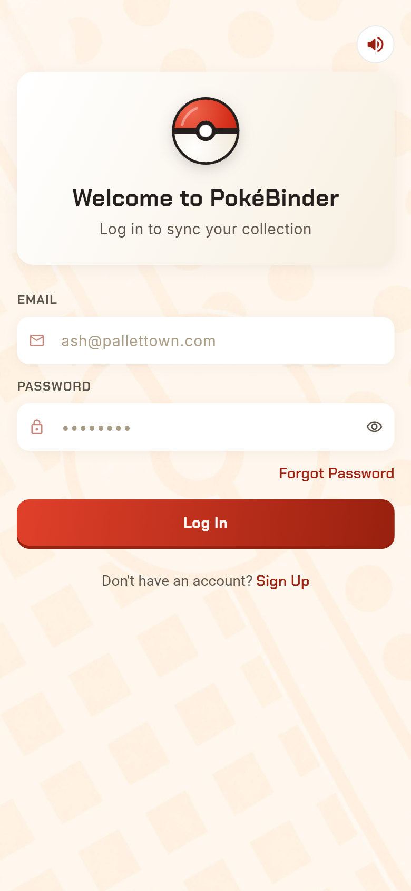 <a href="screenshots/01-login.png">01-login.png</a></td>
<td>

**Purpose**
The entry point for returning users. They sign in to their PokéBinder account with an email address and password, and the collection syncs from Supabase. The screen also links to account creation and password recovery.

**User Actions and Flow**
- The user enters an email address and password (the eye icon shows or hides the password).
- Tapping **Log In** with valid credentials takes the user to 04 Home Dashboard. Empty fields, an invalid email, or wrong credentials show an inline error message instead.
- Tapping **Forgot Password** takes the user to 03 Forgot Password.
- Tapping **Sign Up** takes the user to 02 Sign Up.
- The speaker button in the top-right corner mutes or unmutes all sound on the login screens.

**Navigation**
Shown when the app is launched while signed out, and after signing out from the More tab. Title music plays here.
</td>
</tr>

<tr>
<td><b>02 · Sign Up</b> Authentication · Wireframe page 6  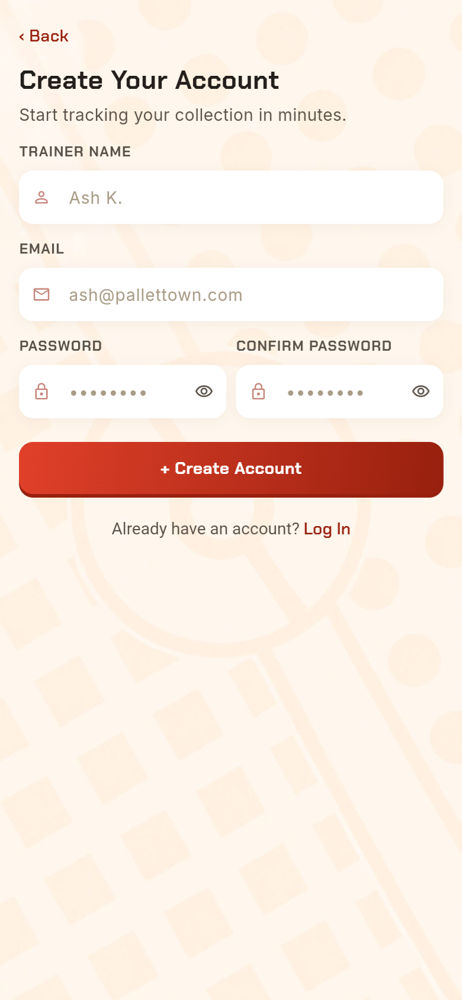 <a href="screenshots/02-sign-up.png">02-sign-up.png</a></td>
<td>

**Purpose**
Lets new users create a PokéBinder account (one account per email) and start tracking their collection.

**User Actions and Flow**
- The user enters a trainer name, email address, password, and password confirmation.
- Tapping **+ Create Account** with valid information creates the account and takes the user to 04 Home Dashboard. If the project requires email confirmation, a message asks the user to check their email, and the user returns to 01 Login.
- Tapping **Log In** (Already have an account?) or **‹ Back** returns to 01 Login.

**Navigation**
Reached from 01 Login through **Sign Up**.
</td>
</tr>

<tr>
<td><b>03 · Forgot Password</b> Authentication · Wireframe page 6  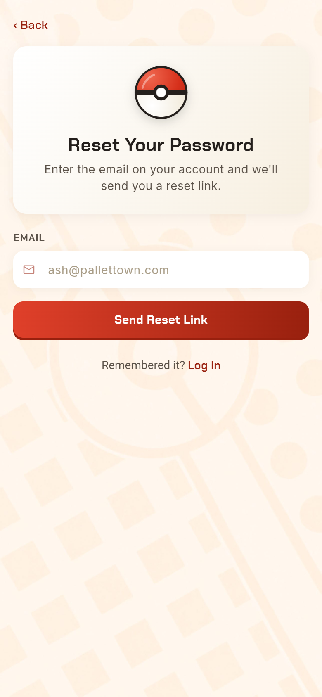 <a href="screenshots/03-forgot-password.png">03-forgot-password.png</a></td>
<td>

**Purpose**
Lets a user who cannot remember their password request a reset link by email.

**User Actions and Flow**
- The user enters the email address on their account (pre-filled if it was typed on the Login screen).
- Tapping **Send Reset Link** sends the request. The screen then changes to a **Check Your Email** state with short steps (open the email, tap the link in the same browser, choose a new password), a spam-folder reminder, and **Back to Log In**.
- In the confirmation state, **Resend Link** becomes available after a 60-second cooldown, and **Use a different email** goes back to the form.
- Tapping **Log In** (Remembered it?) or **‹ Back** returns to 01 Login without sending anything.
- When the user opens the emailed link, a **Choose a New Password** screen (new password and confirmation, minimum length enforced) saves the new password and continues into the app.

**Navigation**
Reached only from 01 Login through **Forgot Password**.
</td>
</tr>

<tr>
<td><b>04 · Home Dashboard</b> Home & Profile · Wireframe page 6   <a href="screenshots/04-home-dashboard.png">04-home-dashboard.png</a></td>
<td>

**Purpose**
Gives an overview of the collection and acts as the main starting point for the app's core features.

**User Actions and Flow**
- The trainer avatar (top left) opens 05 Trainer Card.
- The **Search your whole collection…** bar opens 14 All Cards.
- The **Cards** tile opens 14 All Cards; the **Value** tile opens 24 Collection Statistics; the **Binders** tile opens 09 Binders.
- **+ New Binder** opens 10 Create Binder; **+ New Deck** opens 20 Create Deck.
- **Continue a Binder** (the pinned or most recent binder) opens that binder in 11 Binder Details.
- **Recently Added** shows the latest three cards. Tapping a card opens 15 Card Details, and **View All** opens 14 All Cards.
- **+ Add a New Card** opens the Add tab (17 Add Card).
- The bottom navigation bar switches between the main sections.

**Navigation**
Reached after login or account creation. It is the Home tab and the app's landing screen.
</td>
</tr>

<tr>
<td><b>05 · Trainer Card (Profile)</b> Home & Profile · Wireframe page 6  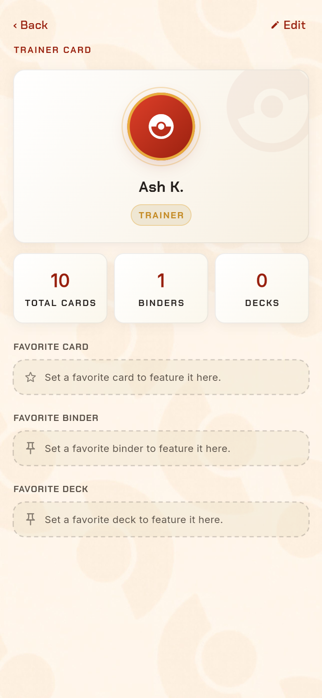 <a href="screenshots/05-trainer-card.png">05-trainer-card.png</a></td>
<td>

**Purpose**
Presents the user's profile and collection identity: avatar, trainer name and title, collection totals, and favorites.

**User Actions and Flow**
- Shows the avatar (or uploaded photo), trainer name, title badge (for example **TRAINER**), and the **Total Cards**, **Binders**, and **Decks** counts.
- **Favorite Card**, **Favorite Binder**, and **Favorite Deck** sections show the user's picks. When nothing is set, a dashed placeholder explains how to set one.
- Tapping **✎ Edit** opens 06 Edit Trainer Card.
- Tapping **‹ Back** returns to 23 More when opened from there, or to 04 Home Dashboard when opened from the avatar.

**Navigation**
Reached from the More tab or from the avatar on the Home Dashboard.
</td>
</tr>

<tr>
<td><b>06 · Edit Trainer Card</b> Home & Profile · Wireframe page 6  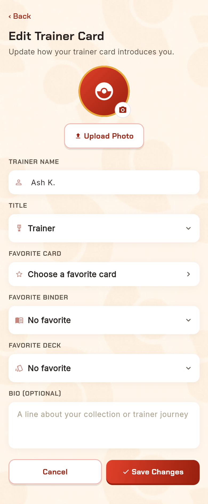 <a href="screenshots/06-edit-trainer-card.png">06-edit-trainer-card.png</a></td>
<td>

**Purpose**
Lets the user customize what appears on their Trainer Card.

**User Actions and Flow**
- **Upload Photo** (or the camera badge on the avatar) picks a profile photo and opens 07 Adjust Photo.
- The user edits **Trainer Name** and chooses a **Title** (Trainer, Gym Leader, Elite Four, Champion, Pokémon Professor, or Collector).
- **Favorite Card** opens 08 Choose Favorite Card.
- **Favorite Binder** and **Favorite Deck** are dropdowns on the same screen.
- **Bio (optional)** holds a short line about the user's collection or journey.
- **Cancel** discards changes; **✓ Save Changes** saves them. Both return to 05 Trainer Card.

**Navigation**
Reached from 05 Trainer Card through **✎ Edit**.
</td>
</tr>

<tr>
<td><b>07 · Adjust Photo</b> Home & Profile · New: Not in the wireframes  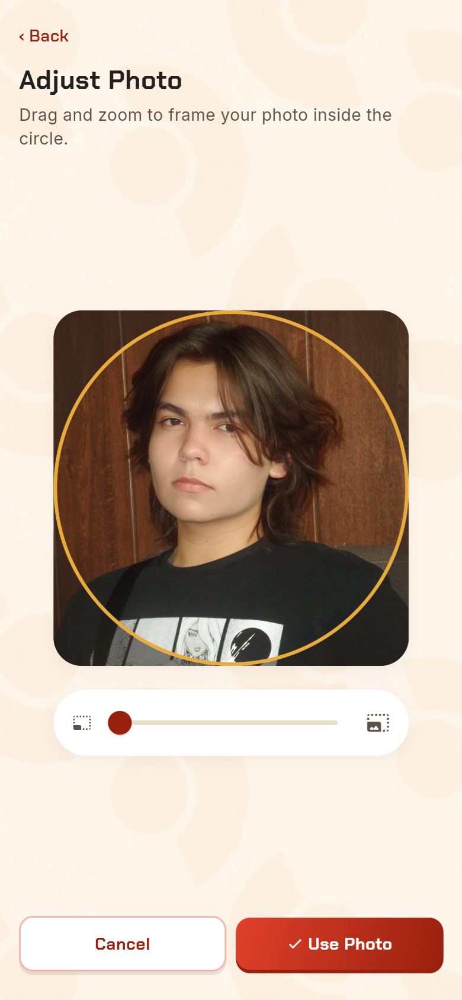 <a href="screenshots/07-adjust-photo.png">07-adjust-photo.png</a></td>
<td>

**Purpose**
Lets the user frame a new profile photo inside the circular avatar before saving it.

**User Actions and Flow**
- The user drags the photo and uses the zoom slider to position it inside the circle.
- **✓ Use Photo** applies the crop and returns to 06 Edit Trainer Card.
- **Cancel** or **‹ Back** returns without changing the photo.

**Navigation**
Reached from 06 Edit Trainer Card after choosing a photo. The photo is stored in Supabase Storage.
</td>
</tr>

<tr>
<td><b>08 · Choose Favorite Card</b> Home & Profile · New: Not in the wireframes  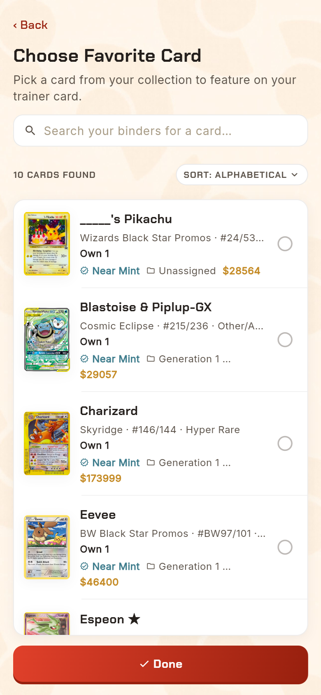 <a href="screenshots/08-choose-favorite-card.png">08-choose-favorite-card.png</a></td>
<td>

**Purpose**
Lets the user pick the card featured on their Trainer Card.

**User Actions and Flow**
- The user searches their collection and sorts the list (for example **Alphabetical**).
- Selecting a card row marks it as the favorite (radio-style circle). Each row shows the artwork, set and number, quantity owned, condition, binder, and estimated value.
- **✓ Done** saves the choice and returns to 06 Edit Trainer Card; **‹ Back** returns without saving.

**Navigation**
Reached from **Favorite Card** on 06 Edit Trainer Card.
</td>
</tr>

<tr>
<td><b>09 · Binders</b> Collection & Binders · Wireframe page 7  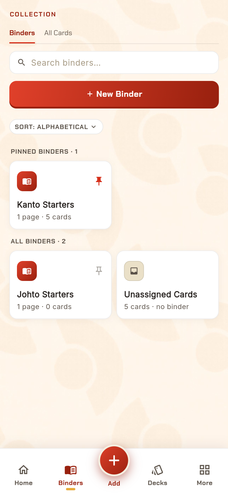 <a href="screenshots/09-binders.png">09-binders.png</a></td>
<td>

**Purpose**
Lets users browse their collection through organized binders.

**User Actions and Flow**
- The **Binders / All Cards** tabs at the top switch between this screen and 14 All Cards.
- **Search binders…** filters the list; the **Sort** menu orders it (Alphabetical, Newest, Oldest, Most Cards, Highest Value).
- **+ New Binder** opens 10 Create Binder.
- Binders can be pinned with the pin icon; pinned binders appear under **Pinned Binders**, the rest under **All Binders** (with **View All Binders (+N)** / **Show Less** when the list is long).
- **Unassigned Cards** is a built-in entry holding cards that are not in any binder, including cards removed from a binder.
- Selecting a binder opens 11 Binder Details.

**Navigation**
Reached through the Binders tab, the **Binders** tile or **Continue a Binder** panel on the Home Dashboard.
</td>
</tr>

<tr>
<td><b>10 · Create Binder</b> Collection & Binders · Wireframe page 7  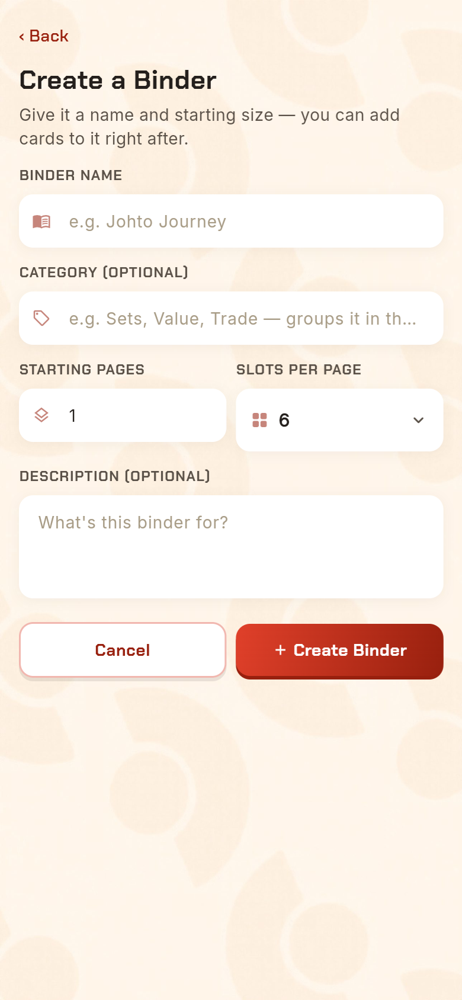 <a href="screenshots/10-create-binder.png">10-create-binder.png</a></td>
<td>

**Purpose**
Creates a new binder with a name and starting structure before cards are added.

**User Actions and Flow**
- The user enters a **Binder Name** and an optional **Category** (for example Sets, Value, Trade), which groups the binder.
- The user selects **Starting Pages** and **Slots per Page**.
- An optional **Description** can be added.
- **Cancel** returns without creating the binder; **+ Create Binder** creates it and returns to 09 Binders.

**Navigation**
Opened from 09 Binders or from **+ New Binder** on the Home Dashboard.
</td>
</tr>

<tr>
<td><b>11 · Binder Details</b> Collection & Binders · New: Not in the wireframes  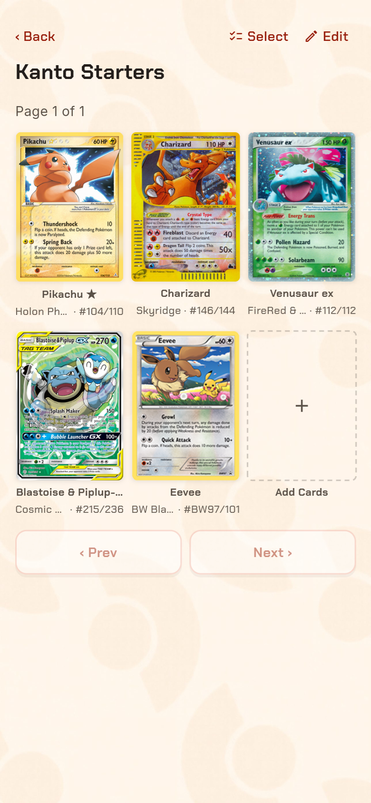 <a href="screenshots/11-binder-details.png">11-binder-details.png</a></td>
<td>

**Purpose**
Shows one binder's contents one page at a time and lets the user manage its cards.

**User Actions and Flow**
- **‹ Back** returns to 09 Binders.
- **✎ Edit** opens 13 Edit Binder (not shown for Unassigned Cards).
- **Select** enters selection mode: the user can select several cards (or select all on the page) and then delete them from the collection (with confirmation) or remove them from the binder, which sends them to Unassigned Cards.
- Tapping a card opens 15 Card Details.
- The dashed **Add Cards** tile opens 12 Add Cards (Binder).
- **‹ Prev** / **Next ›** change the binder page.

**Navigation**
Reached from 09 Binders after selecting a binder, or from **Continue a Binder** on the Home Dashboard.
</td>
</tr>

<tr>
<td><b>12 · Add Cards (Binder)</b> Collection & Binders · New: Not in the wireframes  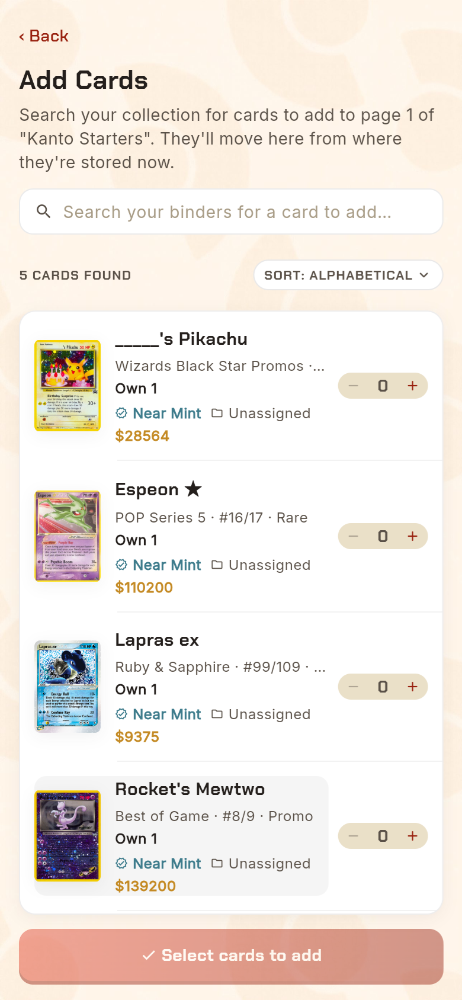 <a href="screenshots/12-add-card-binder.png">12-add-card-binder.png</a></td>
<td>

**Purpose**
Lets the user move cards they already own into the current binder page.

**User Actions and Flow**
- The user searches their binders for a card and sorts the list.
- The **+ / −** steppers choose how many copies to add. Each row shows quantity owned, condition, current binder, and estimated value.
- The bottom button reads **Select cards to add** until a card is chosen, then **✓ Add N cards**; it saves the selection and returns to 11 Binder Details.
- **‹ Back** returns without changes.

**Navigation**
Reached from the **Add Cards** tile on 11 Binder Details.
</td>
</tr>

<tr>
<td><b>13 · Edit Binder</b> Collection & Binders · Wireframe page 7  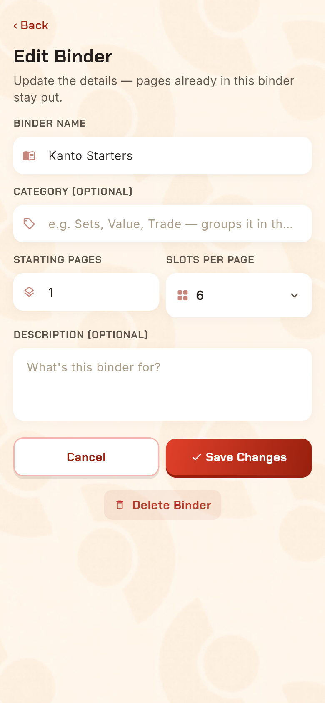 <a href="screenshots/13-edit-binder.png">13-edit-binder.png</a></td>
<td>

**Purpose**
Lets users change an existing binder's name, category, size, or description.

**User Actions and Flow**
- The user edits the name, category, starting pages, slots per page, and description. Pages already in the binder stay put.
- **Cancel** discards changes; **✓ Save Changes** applies them.
- **Delete Binder** removes the binder after confirmation.

**Navigation**
Reached from **✎ Edit** on 11 Binder Details.
</td>
</tr>

<tr>
<td><b>14 · All Cards</b> Collection & Binders · Wireframe page 7  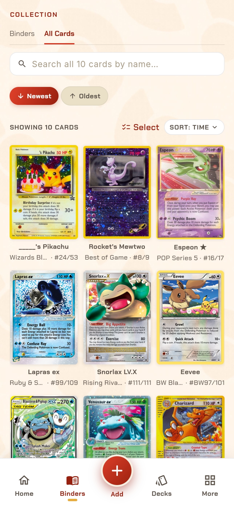 <a href="screenshots/14-all-cards.png">14-all-cards.png</a></td>
<td>

**Purpose**
A complete view of the user's collection, with search, filters, and sorting.

**User Actions and Flow**
- The **Binders** tab returns to 09 Binders.
- **Search all N cards by name…** filters the grid.
- The **Newest / Oldest** chips and the **Sort** menu change the order; type and subtype filters narrow the results.
- **Select** enters selection mode so several cards can be deleted at once (with the same confirmation as a single delete).
- Selecting a card tile opens 15 Card Details.

**Navigation**
Reached from the **Cards** tile, the search bar, or **View All** on the Home Dashboard, or through the **All Cards** tab on 09 Binders.
</td>
</tr>

<tr>
<td><b>15 · Card Details</b> Collection & Binders · Wireframe page 7  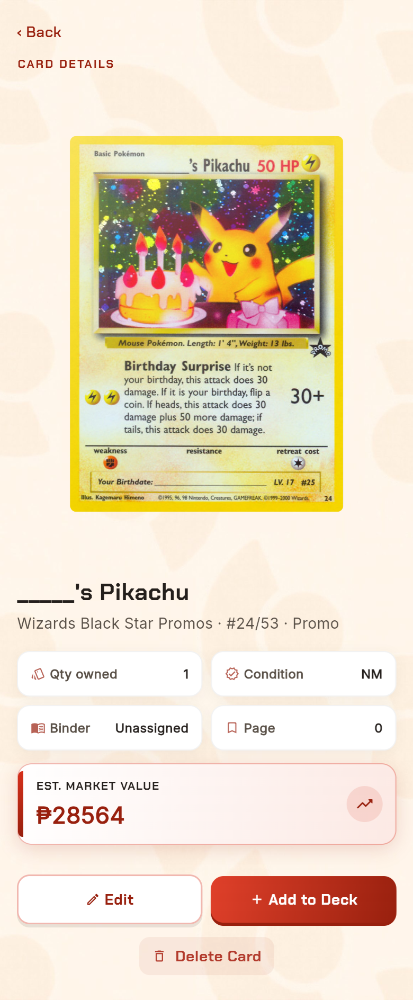 <a href="screenshots/15-card-details.png">15-card-details.png</a></td>
<td>

**Purpose**
A complete view of one card: artwork, set, number, rarity, quantity owned, condition, binder and page, estimated market value in pesos, and notes.

**User Actions and Flow**
- The card artwork is an interactive drag-to-tilt 3D card, the app's signature interaction.
- **✎ Edit** opens 16 Edit Card.
- **+ Add to Deck** opens a sheet to pick a deck and quantity, or create a new deck.
- **Delete Card** removes the card after confirmation. This also removes it from the trade list and decks, and clears it as the trainer-card favorite.
- **‹ Back** returns to the screen where the card was opened.

**Navigation**
Reached from Home, Binders, Binder Details, All Cards, and the card pickers.
</td>
</tr>

<tr>
<td><b>16 · Edit Card</b> Card Entry · Wireframe page 8  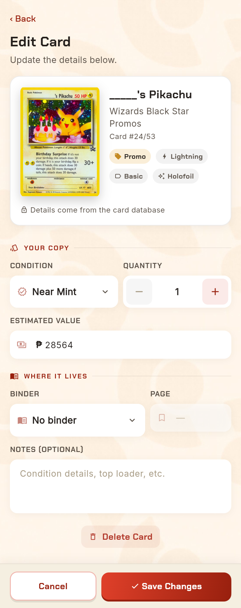 <a href="screenshots/16-edit-card.png">16-edit-card.png</a></td>
<td>

**Purpose**
Updates the user's own copy of a card. Card identity (name, set, number, type) comes from the card database and is read-only.

**User Actions and Flow**
- The user edits **Condition**, **Quantity**, **Estimated Value**, **Binder**, **Page**, and **Notes**.
- **Cancel** returns to 15 Card Details without changes; **✓ Save Changes** saves and returns.
- **Delete Card** opens a confirmation dialog before removing the card.

**Navigation**
Reached from **✎ Edit** on 15 Card Details.
</td>
</tr>

<tr>
<td><b>17 · Add Card (Find Your Card)</b> Card Entry · Wireframe page 8, reworked  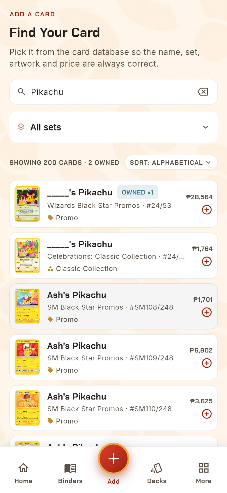 <a href="screenshots/17-add-card.png">17-add-card.png</a></td>
<td>

**Purpose**
The Add tab. It replaces the scanner: the user finds a card in the Pokémon TCG catalog so the name, set, artwork, and price are always correct.

**User Actions and Flow**
- The user searches by card name, filters by set (**All sets**), and sorts the results.
- Each result shows artwork, set and number, rarity, and a peso price. Cards already owned show an **OWNED ×N** badge.
- Tapping a result (or its **+** button) opens 18 Add to Collection.
- After the card is saved, a toast confirms it, with an **Undo** option.

**Navigation**
Reached through the raised **Add** button in the navigation bar or **+ Add a New Card** on the Home Dashboard.
</td>
</tr>

<tr>
<td><b>18 · Add to Collection</b> Card Entry · Wireframe page 8  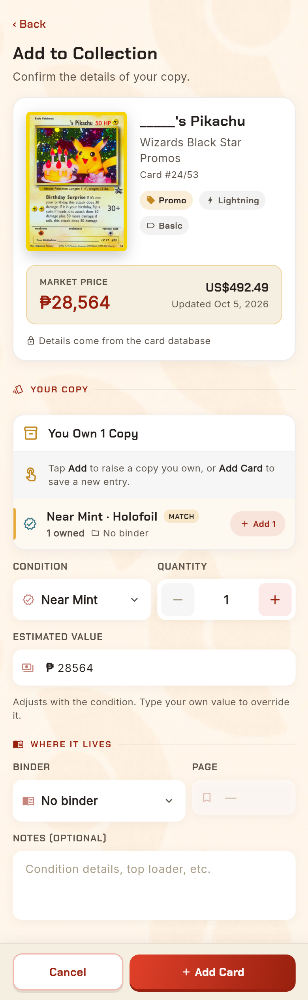 <a href="screenshots/18-add-to-collection.png">18-add-to-collection.png</a></td>
<td>

**Purpose**
Confirms the details of a copy before it is added. It uses the same form as 16 Edit Card.

**User Actions and Flow**
- Shows the card, its market price in pesos (with the US dollar price and the date prices were updated), and a **You Own N Copies** panel with a quick **Add 1** action for a matching copy.
- The user sets **Condition** (the estimated value adjusts with condition and can be overridden), **Quantity**, **Binder**, **Page**, and **Notes**.
- **Cancel** returns to 17 Add Card; **+ Add Card** saves the card and returns to 17.

**Navigation**
Reached after choosing a card on 17 Add Card.
</td>
</tr>

<tr>
<td><b>19 · Deck Planner</b> Deck Planner · Wireframe page 8  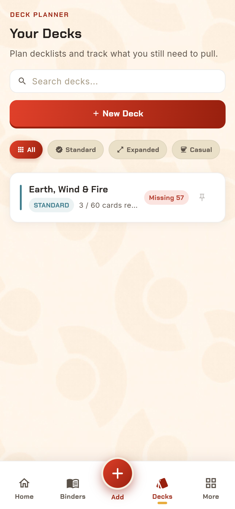 <a href="screenshots/19-deck-planner.png">19-deck-planner.png</a></td>
<td>

**Purpose**
Lists the user's decks with their completion status.

**User Actions and Flow**
- **Search decks…** filters the list; format chips (**All, Standard, Expanded, Casual**) and a **Needs Cards** toggle narrow it; a **Sort** menu orders it.
- **+ New Deck** opens 20 Create Deck.
- Each deck row shows its format, how many cards are ready, and a **Missing N** or **✓ Complete** badge. Decks can be pinned.
- Selecting a deck opens 21 Deck Details.

**Navigation**
Reached through the Decks tab or opened directly from a Home Dashboard shortcut.
</td>
</tr>

<tr>
<td><b>20 · Create Deck</b> Deck Planner · Wireframe page 8  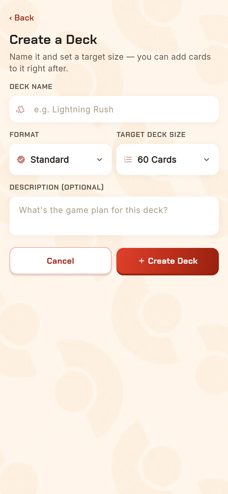 <a href="screenshots/20-create-deck.png">20-create-deck.png</a></td>
<td>

**Purpose**
Creates a new deck with a name, format, target size, and optional description.

**User Actions and Flow**
- The user enters a **Deck Name**, picks a **Format** (Standard, Expanded, or Casual) and a **Target Deck Size** (15, 20, 30, 40, or 60 cards), and may add a description.
- **Cancel** returns without creating the deck; **+ Create Deck** creates it and opens 21 Deck Details.

**Navigation**
Reached from 19 Deck Planner, **+ New Deck** on the Home Dashboard, or when adding a card to a new deck from 15 Card Details.
</td>
</tr>

<tr>
<td><b>21 · Deck Details</b> Deck Planner · New: Not in the wireframes  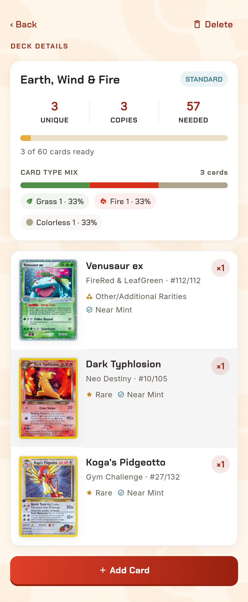 <a href="screenshots/21-deck-details.png">21-deck-details.png</a></td>
<td>

**Purpose**
Shows one deck's completion, card-type mix, and card list, and lets the user manage its cards.

**User Actions and Flow**
- A summary card shows **Unique**, **Copies**, and **Needed** counts, a progress bar (for example "3 of 60 cards ready"), and a **Card Type Mix** bar with percentage chips.
- Selecting a card row opens a quantity dialog to change the quantity, remove the card, or save.
- **+ Add Card** opens 22 Add Cards (Deck).
- **Delete** (top right) removes the deck after confirmation. The cards stay in the collection.
- **‹ Back** returns to 19 Deck Planner; **‹ Prev / Next ›** page through long decks.

**Navigation**
Reached from 19 Deck Planner after selecting or creating a deck.
</td>
</tr>

<tr>
<td><b>22 · Add Cards (Deck)</b> Deck Planner · New: Not in the wireframes  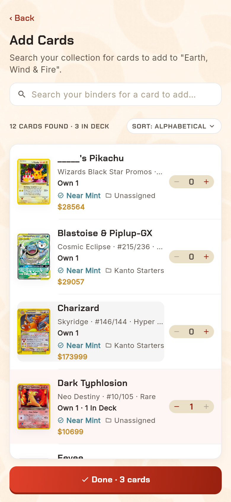 <a href="screenshots/22-add-card-deck.png">22-add-card-deck.png</a></td>
<td>

**Purpose**
Lets the user choose cards from their collection and how many copies of each go in the deck.

**User Actions and Flow**
- The user searches, sorts, and uses the **+ / −** steppers. Rows show quantity owned and how many are already in the deck; the stepper cannot exceed the copies owned.
- **✓ Done · N cards** saves the quantities and returns to 21 Deck Details; **‹ Back** returns without saving.

**Navigation**
Reached from **+ Add Card** on 21 Deck Details.
</td>
</tr>

<tr>
<td><b>23 · More</b> More · Wireframe page 8  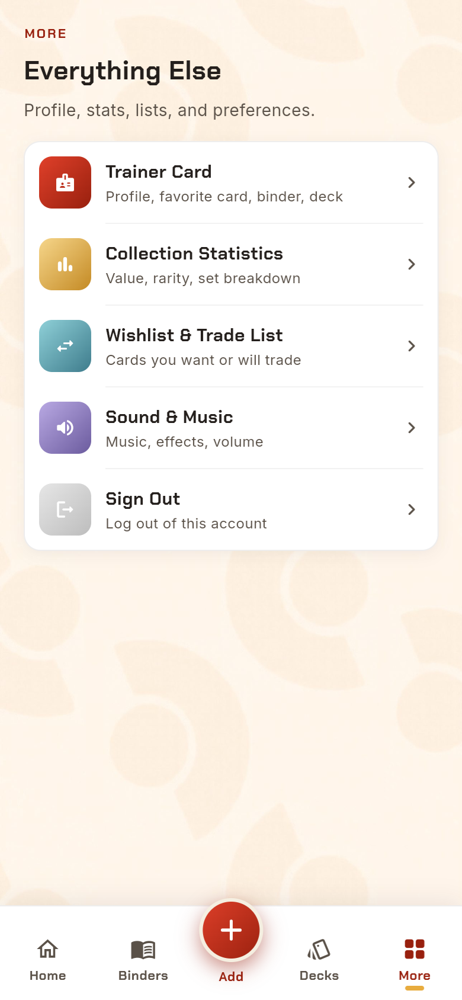 <a href="screenshots/23-more.png">23-more.png</a></td>
<td>

**Purpose**
Gathers the secondary features outside the main navigation.

**User Actions and Flow**
- **Trainer Card** opens 05 Trainer Card.
- **Collection Statistics** opens 24 Collection Statistics.
- **Wishlist & Trade List** opens 25 Wishlist.
- **Sound & Music** opens 31 Sound & Music.
- **Sign Out** asks for confirmation, then signs out and returns to 01 Login.

**Navigation**
Reached through the More tab.
</td>
</tr>

<tr>
<td><b>24 · Collection Statistics</b> More · Wireframe page 9  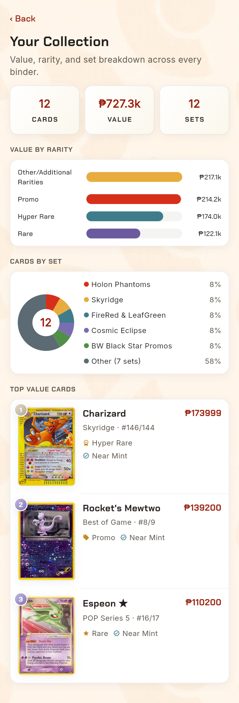 <a href="screenshots/24-collection-statistics.png">24-collection-statistics.png</a></td>
<td>

**Purpose**
Summarizes the collection's size, estimated value, rarity mix, and set mix.

**User Actions and Flow**
- Top tiles show **Cards**, **Value** (estimated, in pesos), and **Sets**.
- **Value by Rarity** shows horizontal bars; **Cards by Set** shows a donut chart with a legend; **Top Value Cards** ranks the most valuable cards.
- **‹ Back** returns to 23 More, or to 04 Home Dashboard when opened from the **Value** tile.

**Navigation**
Reached from 23 More or from the **Value** tile on the Home Dashboard.
</td>
</tr>

<tr>
<td><b>25 · Wishlist</b> More · Wireframe page 9  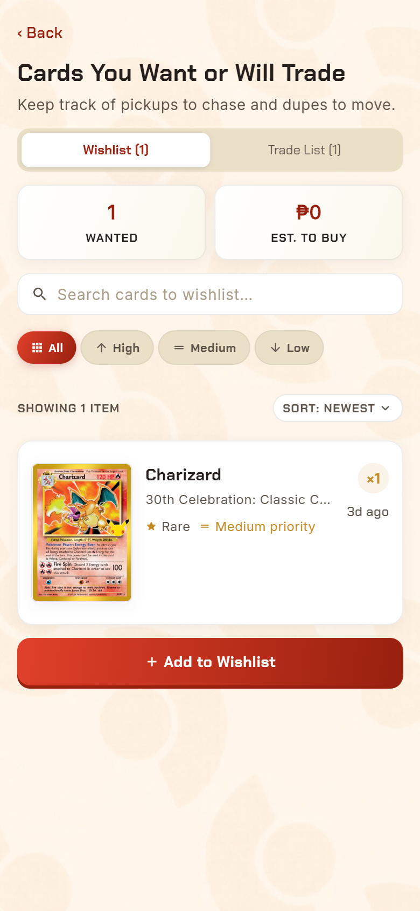 <a href="screenshots/25-wishlist.png">25-wishlist.png</a></td>
<td>

**Purpose**
Keeps the list of cards the user wants. It shares one screen with the Trade List through tabs.

**User Actions and Flow**
- The tabs show counts, for example **Wishlist (1)** and **Trade List (1)**. The **Trade List** tab switches to 28 Trade List.
- Stat tiles show **Wanted** and **Est. to Buy**.
- The user searches, filters by priority (**All, High, Medium, Low**), and sorts (Alphabetical, Newest, Oldest, Priority, Value: High-Low). Long lists are paged.
- Selecting an entry opens 27 Edit Wishlist Card.
- **+ Add to Wishlist** opens 26 Add Card (Wishlist).
- **‹ Back** returns to 23 More.

**Navigation**
Reached from **Wishlist & Trade List** on 23 More.
</td>
</tr>

<tr>
<td><b>26 · Add Card (Wishlist)</b> More · Wireframe page 9, reworked  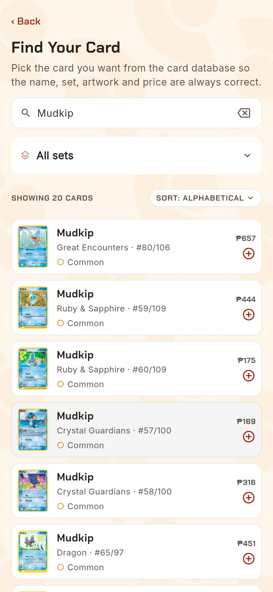 <a href="screenshots/26-add-card-wishlist.png">26-add-card-wishlist.png</a></td>
<td>

**Purpose**
Lets the user pick a card from the card database to add to their wishlist.

**User Actions and Flow**
- The user searches the catalog, filters by set, and sorts the results.
- Choosing a card opens the wishlist form (same layout as 27), where the user sets condition, quantity, estimated value, priority, and notes.
- Saving adds the entry and returns to 25 Wishlist; **‹ Back** returns without adding.

**Navigation**
Reached from **+ Add to Wishlist** on 25 Wishlist.
</td>
</tr>

<tr>
<td><b>27 · Edit Wishlist Card</b> More · New: Not in the wireframes  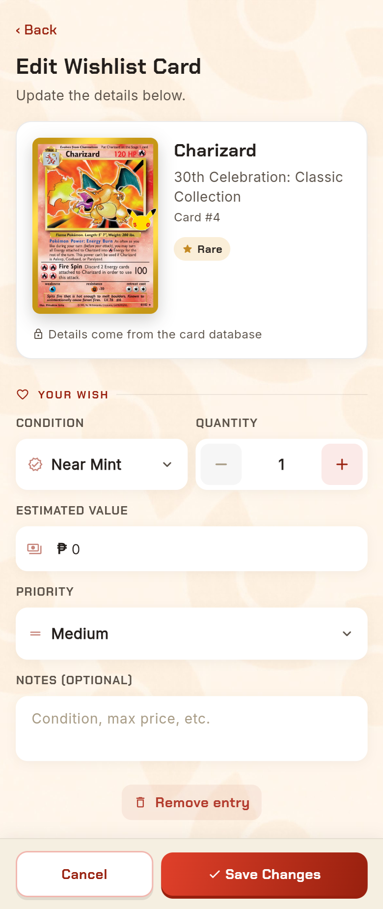 <a href="screenshots/27-edit-wishlist-card.png">27-edit-wishlist-card.png</a></td>
<td>

**Purpose**
Edits a wishlist entry. Card details come from the card database.

**User Actions and Flow**
- The user edits **Condition**, **Quantity**, **Estimated Value**, **Priority** (High, Medium, Low), and **Notes**.
- **Cancel** discards changes; **✓ Save Changes** saves them.
- **Remove entry** deletes the entry after confirmation, with an **Undo** toast.

**Navigation**
Reached by selecting an entry on 25 Wishlist.
</td>
</tr>

<tr>
<td><b>28 · Trade List</b> More · Wireframe page 9  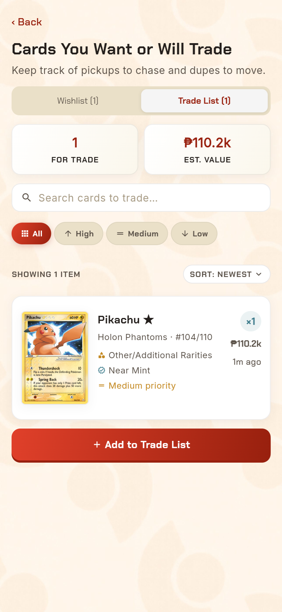 <a href="screenshots/28-trade-list.png">28-trade-list.png</a></td>
<td>

**Purpose**
Keeps the list of cards the user is willing to trade, using the same structure as the Wishlist.

**User Actions and Flow**
- The **Wishlist** tab switches to 25 Wishlist.
- Stat tiles show **For Trade** and **Est. Value**.
- The user searches, filters by eagerness (**All, High, Medium, Low**), and sorts. Rows show quantity, condition, value, and how recently the entry was added.
- Selecting an entry opens 30 Edit Trade Entry.
- **+ Add to Trade List** opens 29 Add Cards (Trade List).
- **‹ Back** returns to 23 More.

**Navigation**
Reached by switching tabs from 25 Wishlist.
</td>
</tr>

<tr>
<td><b>29 · Add Cards (Trade List)</b> More · New: Not in the wireframes  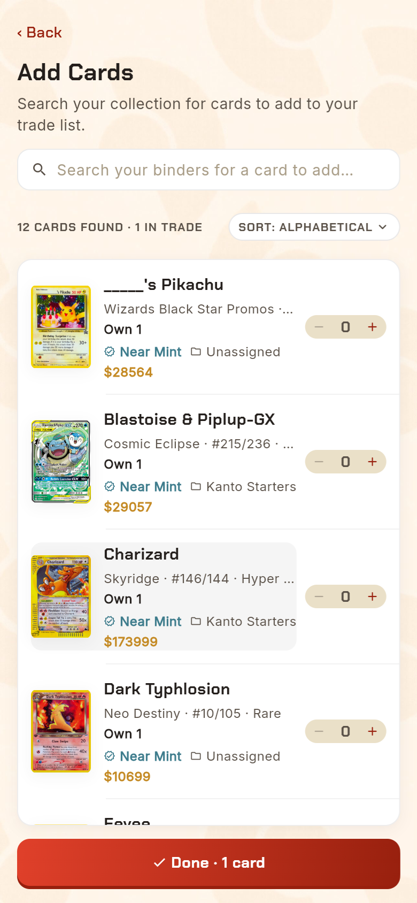 <a href="screenshots/29-add-card-trade-list.png">29-add-card-trade-list.png</a></td>
<td>

**Purpose**
Lets the user choose cards from their collection to offer for trade.

**User Actions and Flow**
- The user searches, sorts, and uses the **+ / −** steppers to set how many copies are for trade.
- **✓ Done · N cards** saves the selection and returns to 28 Trade List; **‹ Back** returns without saving.

**Navigation**
Reached from **+ Add to Trade List** on 28 Trade List.
</td>
</tr>

<tr>
<td><b>30 · Edit Trade Entry</b> More · Wireframe page 9  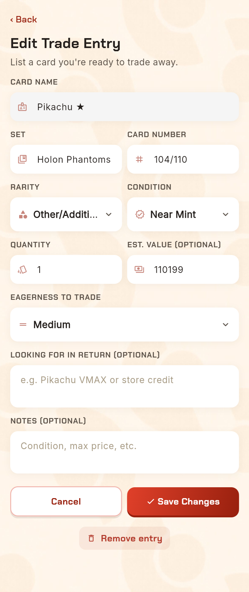 <a href="screenshots/30-edit-trade-list-card.png">30-edit-trade-list-card.png</a></td>
<td>

**Purpose**
Edits the terms of a card listed for trade.

**User Actions and Flow**
- Card name is locked; the user can adjust set, card number, rarity, condition, quantity, and estimated value, and set **Eagerness to Trade** (High, Medium, Low).
- **Looking for in return** and **Notes** are optional text fields.
- **Cancel** discards changes; **✓ Save Changes** saves them; **Remove entry** takes the card off the trade list.

**Navigation**
Reached by selecting an entry on 28 Trade List.
</td>
</tr>

<tr>
<td><b>31 · Sound & Music</b> More · New: Not in the wireframes  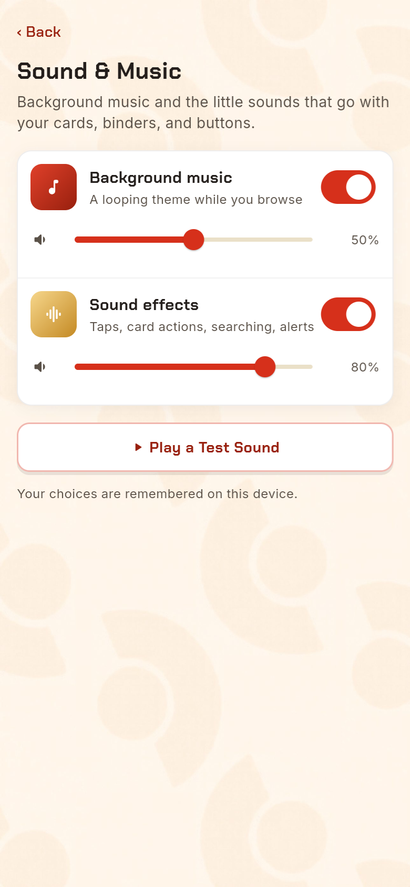 <a href="screenshots/31-sound-and-music.png">31-sound-and-music.png</a></td>
<td>

**Purpose**
Controls the app's background music and sound effects.

**User Actions and Flow**
- Separate toggles and volume sliders for **Background music** and **Sound effects**.
- **▶ Play a Test Sound** previews the current effect volume.
- Choices are remembered on the device. **‹ Back** returns to 23 More.

**Navigation**
Reached from **Sound & Music** on 23 More.
</td>
</tr>
</table>

---

## B. Journey

The main user journey is finding a card, adding it to the collection, placing it in a binder, and finding it again.

| Step | Screen | Screenshot |
| --- | --- | --- |
| 1 | 01 · Login |  |
| 2 | 04 · Home Dashboard |  |
| 3 | 17 · Add Card (Find Your Card) |  |
| 4 | 18 · Add to Collection |  |
| 5 | 09 · Binders |  |
| 6 | 11 · Binder Details |  |
| 7 | 15 · Card Details |  |

The wireframe sanity check originally described this journey as scan, confirm, add to binder, then find the card again. Since the scanner was removed (see below), the first half of the journey is now: search the catalog, confirm the details in Add to Collection, and save. The user then opens a binder and finds the card again through Binder Details and Card Details.

---

## C. What Changed, and Why

This section outlines the changes between the original mockup, which consisted of 29 screens and was submitted on September 20, 2026, and the updated version, which reflects the current app in the repository and includes 31 screens.

| Screen or Element | PDF Mockup | Current App (This Version) | Why It Changed |
| --- | --- | --- | --- |
| Screen count and numbering | 29 screens, numbered 01 to 29 (01 Login, 02 Forgot Password, 03 Sign Up, and so on). | 31 screens, numbered to match the files in `docs/screenshots/`. Sign Up is now 02 and Forgot Password is 03. | The screenshots are the source of truth, so numbers and filenames now line up. |
| Card Scanner (15) and Confirm Card (16) | Camera viewfinder with a **Capture** button, a **Recent Scans** list, and a confirmation screen before saving. | **Removed.** Replaced by 17 Add Card (Find Your Card), a searchable catalog, and 18 Add to Collection. | The scanner was only a simulated demo and was removed on Oct 4. Catalog search gets a correct card into the collection without a camera and works in a browser. |
| Bottom Navigation Bar | Raised **Scan** button. | Tabs are Home, Binders, **Add**, Decks, More. The raised button is now **Add**. | Scanning no longer exists. |
| 01 Login | Gold "PB" monogram, Google and Apple sign-in buttons, Forgot Password above Log In. | Pokéball emblem, email and password only (no Google or Apple), Forgot Password above Log In, plus a speaker button to mute sound. | Social sign-in was not built. Sound control was added for the login screens. |
| 02 Sign Up | Account creation always went to the Home Dashboard. | Goes to Home, or shows a "check your email" message and returns to Login if email confirmation is required. | Matches how Supabase sign-up behaves. |
| 03 Forgot Password | Send reset link, then return to Login. | After sending, shows a **Check Your Email** state with steps, a 60-second **Resend Link** cooldown, and **Use a different email**. A **Choose a New Password** screen handles the emailed link. | Gives feedback and completes the reset flow inside the app. |
| 04 Home Dashboard | Search bar, Total Cards, Estimated Value, and Binders tiles, a Quick Actions section with **+ Scan a new card**, and **+ New binder** / **+ New deck**. | Tiles are Cards, Value, Binders. Quick Actions are **+ New Binder** and **+ New Deck**. Adds a **Continue a Binder** panel, a **Recently Added** row with **View All**, and **+ Add a New Card**. The search bar opens All Cards. | Scanning was replaced by the Add tab. The new panels give quicker access to common tasks. |
| 05 Trainer Card | Avatar, trainer info, collection totals, favorite deck, favorite Pokémon, and achievement badges. | Avatar, name, title badge, Total Cards, Binders, and Decks counts, and **Favorite Card**, **Favorite Binder**, and **Favorite Deck** sections with empty states. No achievement badges. | Favorites were made consistent across cards, binders, and decks. Badges were not built. |
| 06 Edit Trainer Card | Avatar presets or upload, name, title, favorite Pokémon, favorite deck, card back, country, and biography. | Photo upload, trainer name, **Title** picker (Trainer, Gym Leader, Elite Four, Champion, Pokémon Professor, Collector), Favorite Card, Favorite Binder, Favorite Deck, and optional Bio. No country or card back. | Reduced to the options that were built. |
| 07 Adjust Photo (new) | Not in the PDF. | Drag-and-zoom crop of the profile photo inside the avatar circle, with **✓ Use Photo**. | Needed to frame uploaded photos. |
| 08 Choose Favorite Card | Select a card row, **Clear**, **Done**. | Search, sort, select a card row (radio circle), and **✓ Done**. | The picker now matches the other card lists. |
| 09 Binders | Binder rows with **✎ Edit binder** and **Prev / Next page** controls, plus a dashed **+** tile. | Binder search, sort (Alphabetical, Newest, Oldest, Most Cards, Highest Value), **Pinned Binders** and **All Binders** sections, pin icons, optional categories, and a built-in **Unassigned Cards** entry. Editing moved to Binder Details. | Cards removed from a binder need a place to go, and pinning and sorting help with many binders. |
| 10 Create Binder | Name, starting pages, slots per page, description. | Adds an optional **Category**. | Lets binders be grouped. |
| 11 Binder Details | **Remove** mode: tap a card to confirm removal. | **Select** mode: choose several cards (or select all on the page), then delete them from the collection or remove them from the binder. | Multi-select makes bulk cleanup possible. |
| 12 Add Cards (Binder) | Search, filters, sort, steppers, **Add N cards**. | Search, sort, steppers, and a button that reads **Select cards to add** until a card is chosen, then **✓ Add N cards**. Filters are not shown. | Matches the built screen. |
| 13 Edit Binder | Name, pages and slots, description, Save. | Adds **Category** and a **Delete Binder** button (with confirmation). | Binders can now be deleted from here. |
| 14 All Cards | Search and type chips (All, Normal, Grass, Water, Fire). | Search, **Newest / Oldest** chips, a **Sort** menu, type and subtype filters, and **Select** for multi-delete. | Easier to find or clean up cards in a larger collection. |
| 15 Card Details | Review info, **✎ Edit card**, drag-to-tilt 3D card. | Same 3D card and info, plus **+ Add to Deck** (pick a deck and quantity, or create one) and **Delete Card**. Deleting also removes the card from the trade list and decks and clears it as favorite. | Lets users act on a card from one place without leaving broken references. |
| 16 to 18 Card forms | Confirm Card, Add Card, and Edit Card were manual-entry forms (name, set, number, rarity, and so on) with **+ Add to binder**. | Edit Card and Add to Collection share one form. Card identity comes from the catalog and is read-only; the user edits Condition, Quantity, Estimated Value, Binder, Page, and Notes. Add to Collection shows the peso price (and US dollar price and date) and a **You Own N Copies** panel. Button is **+ Add Card**. | Real card data makes entries correct and prices available (TCGplayer prices, adjusted by condition). |
| 19 Deck Planner | Deck rows plus an **Editing** section to search binders and add cards on the same screen. | A deck list with search, format chips (All, Standard, Expanded, Casual), a **Needs Cards** toggle, sort, pinning, and **Missing N** / **✓ Complete** badges. Editing moved to Deck Details. | Separating the list from editing gives each more room. |
| 20 Create Deck | Name, format, target size, description. Returns to the planner. | Target sizes are 15, 20, 30, 40, or 60. **+ Create Deck** opens the new deck's Deck Details. | Takes the user straight to adding cards. |
| 21 Deck Details | Quantity dialog, **+ Add Card**, paging. | Adds a summary (Unique, Copies, Needed), a progress bar, a **Card Type Mix** bar, and **Delete** (cards stay in the collection). | Shows deck completion at a glance. |
| 22 Add Cards (Deck) | Search, filters, sort, steppers, **Done N cards**. | Same, with rows showing how many are already in the deck. | Matches the built screen. |
| 23 More (was 24) | Trainer Card, Collection Statistics, Wishlist & Trade List. | Adds **Sound & Music** and **Sign Out** (with confirmation). | Sound settings and sign-out needed a home. |
| 24 Collection Statistics (was 25) | Total cards, estimated value, Value by Rarity, Cards by Set. | Tiles are **Cards, Value, Sets**, plus Value by Rarity, Cards by Set (donut with legend), and **Top Value Cards**. | More useful breakdown of the collection. |
| 25 to 30 Wishlist and Trade List | Two simple tabs. Add Wishlist and Trade Card were manual-entry forms. | Tabs show counts, stat tiles (Wanted / Est. to Buy and For Trade / Est. Value), search, priority chips, sorting, and paging. Wishlist adds cards through a catalog picker (26). Trade List adds through a collection picker (29). Entries open edit screens (27, 30), and removal asks for confirmation and offers **Undo**. | The original lists were too simple for a larger collection, and real card data replaced manual entry. |
| 31 Sound & Music (new) | Not in the PDF. | Toggles and volume sliders for background music and sound effects, a **Play a Test Sound** button, and settings remembered on the device. | The app has chiptune effects and two looping themes. |
| Data and accounts | Not covered. | Cards, binders, decks, wishlist, trade list, and profile are saved to Supabase per user (Row Level Security). Writes are online-only. | Moves the app from mock data to real, synced data. |
| Design system | Added success, warning, information, card-type, and scanner colors. | Same palette without the scanner colors. See [`03-design-system.pdf`](03-design-system.pdf). | The scanner screens no longer exist. |
