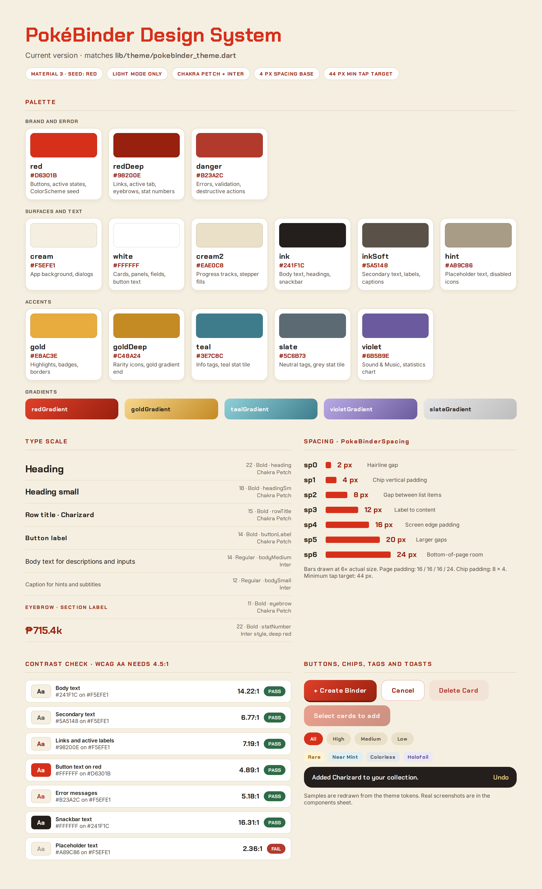
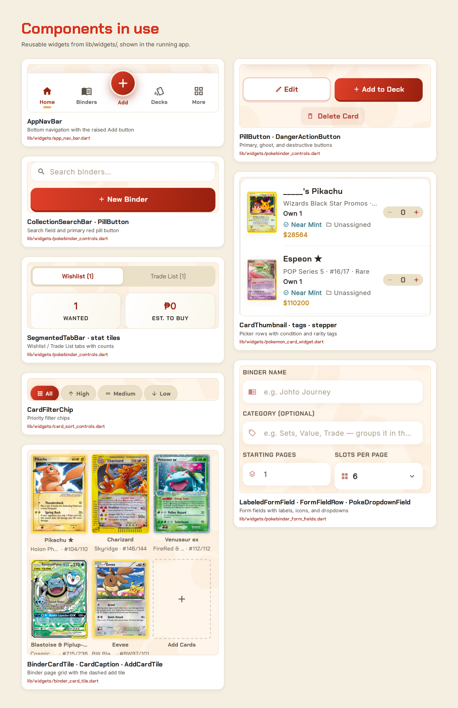

# Design system

PokéBinder's look is defined in one place, [`lib/theme/pokebinder_theme.dart`](../lib/theme/pokebinder_theme.dart), plus the shared widgets in [`lib/widgets/`](../lib/widgets/). This document matches the current version of the app.

**Basics**

- **Light mode only.** `main.dart` uses `PokeBinderTheme.light()` and has no dark theme.
- **Material 3**, with `ColorScheme.fromSeed()` seeded from `PokeBinderColors.red`, plus the named colors below used directly in the UI.
- **Fonts:** Chakra Petch for UI (headings, labels, buttons, tabs, chips, card captions) and Inter for body text, loaded with `google_fonts`. The font files are bundled in `assets/google_fonts/`.



## Palette

| Role | Name in code | Hex | Used for |
| --- | --- | --- | --- |
| Primary red | `red` | `#D6301B` | Main buttons, active states, brand color, `ColorScheme` seed |
| Deep red | `redDeep` | `#98200E` | Links, active tab label, eyebrow text, stat numbers, pressed states |
| Background | `cream` | `#F5EFE1` | App background (scaffold) and dialogs |
| Surface | `white` | `#FFFFFF` | Cards, panels, text fields, text on red buttons |
| Inset cream | `cream2` | `#EAE0C8` | Progress tracks, stepper fills, inset areas |
| Text | `ink` | `#241F1C` | Body text, headings, snackbar background |
| Soft text | `inkSoft` | `#5A5148` | Secondary text, labels, captions |
| Error | `danger` | `#B23A2C` | Error messages, validation, destructive actions |
| Gold | `gold` | `#E8AC3E` | Highlights, badges, borders |
| Deep gold | `goldDeep` | `#C48A24` | Rarity icons, end of the gold gradient |
| Teal | `teal` | `#3E7C8C` | Info tags, the teal stat tile |
| Slate | `slate` | `#5C6B73` | Neutral tags, the grey stat tile |
| Violet | `violet` | `#6B5B9E` | Sound & Music row, one chart color in Statistics |
| Hint | `hint` | `#6F6457` | Placeholder text and disabled icons |

Gradients: `redGradient` (primary buttons), `goldGradient`, `tealGradient`, `violetGradient`, and `slateGradient` (More-menu icon tiles and stat tiles).

**Contrast.** Ratios were calculated from the hex values above, against `cream` unless noted. WCAG AA needs 4.5:1 for normal text.

| Pair | Ratio | Result |
| --- | --- | --- |
| `ink` on `cream` (body text) | 14.22:1 | Pass |
| `inkSoft` on `cream` (secondary text) | 6.77:1 | Pass |
| `redDeep` on `cream` (links, active labels) | 7.19:1 | Pass |
| `white` on `red` (button text) | 4.89:1 | Pass |
| `danger` on `cream` (error text) | 5.18:1 | Pass |
| `white` on `ink` (snackbar) | 16.31:1 | Pass |
| `hint` on `white` (placeholder text inside inputs, which have a white fill) | 5.77:1 | Pass |
| `hint` on `cream` (placeholder text on the page background) | 5.04:1 | Pass |

Known gaps: `teal` on `cream` is 4.10:1 and `red` on `cream` is 4.26:1, so they are used for icons, tags, and large or bold text rather than body copy. `goldDeep` (2.61:1) is for decorative icons only.

## Type scale

Two families: **Chakra Petch** for UI and **Inter** for body text. Text uses the named styles in `PokeBinderText` instead of raw font sizes.

| Style | Slot in code | Size | Weight | Font | Used for |
| --- | --- | --- | --- | --- | --- |
| Heading | `PokeBinderText.heading` | 22 | Bold | Chakra Petch | Screen titles |
| Heading (small) | `PokeBinderText.headingSm` | 18 | Bold | Chakra Petch | Dialog titles, deck names, trainer names |
| Row title | `PokeBinderText.rowTitle` | 15 | Bold | Chakra Petch | Card, binder, and deck names |
| Button label | `buttonLabel`, `buttonGhostLabel`, `buttonDangerLabel` | 14 | Bold | Chakra Petch | Buttons (white, deep red, or danger red) |
| Back link / pill | `backLink`, `pillLabel` | 14 | 600 / Bold | Chakra Petch | Back links and selectable pills |
| Tab label | `tabLabelActive`, `tabLabelInactive` | 12 | Bold / Regular | Chakra Petch | Bottom navigation labels |
| Form label | `formLabel` | 12 | Bold | Chakra Petch | Labels above form fields |
| Eyebrow / section label | `eyebrow`, `sectionLabel`, `statLabel`, `resultCount` | 11 | Bold | Chakra Petch | Small headings, stat labels, result counts |
| Chip and tag | `chipLabel`, `chipLabelActive`, `tagLabel` | 11 | Bold | Chakra Petch | Chips and tags |
| Card caption | `cardName`, `cardMeta` | 11 | Bold / 500 | Chakra Petch | Names and set info under card tiles |
| Stat number | `statNumber`, `statNumberSm` | 22 / 18 | Bold | Inter | Large numbers on stat tiles |
| Body | `TextTheme.bodyMedium` (and `input`) | 14 | Regular | Inter | Normal text and input fields |
| Subtitle | `PokeBinderText.subtitle` (and `hint`) | 14 | Regular | Inter | Supporting text and placeholders |
| Field value | `fieldValue` | 12 | Bold | Inter | Form values |
| Select value | `selectValue` | 15 | 600 | Inter | Selected value in dropdowns |
| List row title | `listRowTitle` | 14 | Regular | Inter | Titles in simple list rows |
| Quantity label | `quantityLabel(active:)` | 14 | Bold | Chakra Petch | Quantity numbers (deep red when active, soft ink when not) |
| Caption | `TextTheme.bodySmall`, `fieldLabel`, `listRowSubtitle`, `formError` | 12 | Regular | Inter | Hints, subtitles, and form errors |

```dart
Text('Charizard', style: PokeBinderText.rowTitle)
```

## Spacing

Spacing comes from `PokeBinderSpacing`, in multiples of a 4 px base unit.

| Token | Value | Typical use |
| --- | --- | --- |
| `sp0` | 2 px | Hairline gap, title to subtitle |
| `sp1` | 4 px | Chip vertical padding, tight gaps |
| `sp2` | 8 px | Gap between list items, chip horizontal padding |
| `sp3` | 12 px | Label to content, card grid row gap |
| `sp4` | 16 px | Screen edge padding, gap between sections |
| `sp5` | 20 px | Larger gaps, used sparingly |
| `sp6` | 24 px | Bottom-of-page breathing room, larger section gaps |

Presets: `PokeBinderSpacing.page` (16 / 16 / 16 / 24 left, top, right, bottom) and `PokeBinderSpacing.chip` (8 horizontal, 4 vertical). Other constants: `kMinTapTarget` = 44 px (applied with `MinTapTarget`), `kFilterChipRowHeight` = 44, `kCardCaptionHeight` = 36, and a card shadow `kCardElevation` (ink at 6% opacity, blur 10, offset 3).

**Motion.** Durations and curves are shared in `lib/theme/pokebinder_motion.dart` (for example press 100 ms, page 380 ms, deal 650 ms, `smooth` = `easeOutCubic` for most movement, `bounce` = `easeOutBack`, `spring` = `elasticOut`, and `curve` = `easeOut`). Every animated widget passes its duration through `PokeBinderMotion.adapt`, so when the device's reduce-motion / disable-animations setting is on, durations become zero and the page transition is skipped. Page transitions use `PokeBinderPageTransitionsBuilder` on Android, Fuchsia, Linux and Windows, and the Cupertino transition on iOS and macOS.

**Theme-level styles** (in `PokeBinderTheme.light()`): dialogs use the cream background with 16 px corners; text buttons use deep red; snackbars are floating, 18 px rounded, ink background with white Chakra Petch text; ink splashes use `SoundSplashFactory` so every tap ticks.

## Components



_The sheet above was captured before the placeholder color was darkened to `#6F6457` (see Palette), so its placeholder text still shows the old, lighter `#A89C86`. Retake it to update._

Reusable widgets in `lib/widgets/`. Parameters are the constructor fields; "Appears on" lists the screens that use the widget.

### Navigation and layout

| Component | File | Parameters | Appears on |
| --- | --- | --- | --- |
| `AppNavBar` | `app_nav_bar.dart` | `current`, `onChanged` | App shell (Home, Binders, Add, Decks, More; Add is the raised button) |
| `PokeBinderScaffold` | `pokebinder_background.dart` | `backdrop`, `body`, `bottomNavigationBar`, `floatingActionButton` | Nearly every screen |
| `PokeBinderBackground` | `pokebinder_background.dart` | `backdrop`, `child` | Behind scaffolds (arcs or Pokéball backdrop images) |
| `BackLink` | `pokebinder_controls.dart` | `onTap`, `label` | 21 screens opened from a tab |
| `MinTapTarget` | `min_tap_target.dart` | `child`, `onTap`, `size`, `semanticLabel`, `alignment` | Home, Binders, Decks, selection bar |
| `AuthBanner` | `auth_banner.dart` | `heading`, `subtitle`, `footer` | Login, Forgot Password |

### Cards and collection

| Component | File | Parameters | Appears on |
| --- | --- | --- | --- |
| `BinderCardTile` | `binder_card_tile.dart` | `card`, `onTap` | Home, Binders, Binder Details |
| `AddCardTile` | `binder_card_tile.dart` | `onTap` | Binder Details |
| `CardCaption` | `card_caption.dart` | `card` | Home, Binders, Binder Details |
| `CardImage` | `card_image.dart` | `path`, `fit`, `thumbnail`, `cacheWidth` | Inside card tiles and the card widget |
| `CardThumbnail` | `pokemon_card_widget.dart` | `card`, `imageAssetPath`, `width`, `height`, `borderRadius` | Add Cards pickers, Deck Details, Stats, Trainer Card, Favorite Card, Wishlist, Trade List |
| `PokemonCard` | `pokemon_card_widget.dart` | `card` | Card Details |
| `PokemonCardArt` | `pokemon_card_widget.dart` | `imagePath` | Card viewer |
| `PokemonCardBack` | `pokemon_card_widget.dart` | `shadow` | Card Details, card viewer, tiles without images |
| `Interactive3DCard` | `interactive_3d_card.dart` | `child`, `back`, `maxVerticalTilt`, `horizontalSensitivity`, `verticalSensitivity`, `holo`, `cornerRadiusFraction` | Card Details, card viewer |
| `RarityTag`, `ConditionTag` | `card_tags.dart` | `rarity` / `code` | Deck Details, Stats, Trainer Card, Wishlist |
| `CatalogPicker` | `catalog_picker.dart` | `header`, `onPick`, `counts`, `countLabel` | Add Card (Find Your Card), Add Card (Wishlist) |
| `CatalogSummary`, `InfoChip` | `catalog_card_summary.dart` | `name`, `setName`, `number`, `rarity`, `type`, `imagePath`, `priceUsd`, `pricePhp`, and more; `icon`, `label`, `highlight` | Add to Collection, Edit Card, Wishlist form |
| `CardSelectAction`, `CardSelectionHeader`, `CardSelectionMark`, `CardSelectionBar` | `card_selection.dart` | `icon`, `label`, `onTap`; `selectedCount`, `allSelected`, `onSelectAll`, `onCancel`; `selected`; `selectedCount`, `onDelete`, `onRemoveFromBinder` | All Cards and Binder Details (multi-select), Deck Details (select action) |

### Search, sort, and filters

| Component | File | Parameters | Appears on |
| --- | --- | --- | --- |
| `CollectionSearchBar` | `pokebinder_controls.dart` | `hint`, `controller`, `text`, `onChanged`, `onTap`, `enabled` | Home, Binders, Decks, Wishlist, pickers |
| `SegmentedTabBar` | `pokebinder_controls.dart` | `index`, `labels`, `onChanged` | Wishlist and Trade List tabs |
| `CardSortSelector` | `card_sort_controls.dart` | `selected`, `onChanged`, `options` | All Cards, pickers, Favorite Card |
| `CardFilterChip` | `card_sort_controls.dart` | `label`, `icon`, `active`, `onTap` | Wishlist and Trade List priority chips |
| `TypeChipRow`, `FilterChipRow` | `card_sort_controls.dart` | `selected`, `onChanged`; `options`, `selected`, `onChanged`, `iconFor` | Sub-filter rows under the sort selector |
| `EmptyFilterState` | `pokebinder_controls.dart` | `icon`, `title`, `subtitle`, `onClearFilters`, `clearFiltersLabel` | Binders, Decks, pickers, Binder Details |

### Buttons and forms

| Component | File | Parameters | Appears on |
| --- | --- | --- | --- |
| `PillButton` | `pokebinder_controls.dart` | `label`, `onTap`, `ghost`, `enabled`, `icon`, `loading` | 21 screens: every form, Login, Sign Up, Binders, Decks, Home, Card Details |
| `DangerActionButton` | `pokebinder_controls.dart` | `label`, `onTap` | Card, Binder, Wishlist, Trade, and Trainer forms |
| `LabeledFormField` | `pokebinder_form_fields.dart` | `label`, `child` | Form and auth screens |
| `FormFieldRow` | `pokebinder_form_fields.dart` | `left`, `right` | Binder, Card, Deck, Sign Up, Trade, and Wishlist forms |
| `PokeDropdownField<T>` | `pokebinder_form_fields.dart` | `value`, `options`, `onChanged`, `icon`, `height` | Card, Binder, Deck, Wishlist, Trade, and Trainer forms |
| `PokeSearchableDropdownField<T>` | `pokebinder_form_fields.dart` | `value`, `options`, `onChanged`, `icon`, `title`, `searchHint`, `noMatchesTitle` | Set filter in the catalog picker |
| `QuantityStepper` | `card_form_parts.dart` | `value`, `onChanged` | Card form, Wishlist form |
| `EstimatedValueField`, `FinishChip`, `FormSectionTitle`, `FormActionBar`, `MiniAction` | `card_form_parts.dart` | `controller`, `suggested`, `edited`, …; `label`, `price`, `selected`, `onTap`; `icon`, `label`; `label`, `icon`, `onSubmit`; `label`, `icon`, `onTap`, `quiet` | Card form, Wishlist form |
| `AuthLinkText` | `pokebinder_controls.dart` | `prefix`, `linkLabel`, `onTap`, `textAlign` | Login, Sign Up, Forgot Password |
| `PasswordVisibilityToggle` | `pokebinder_controls.dart` | `obscured`, `onTap` | Login, Sign Up, Reset Password |
| `TrainerAvatar` | `trainer_avatar.dart` | `imageUrl`, `imageBytes`, `size`, `iconSize`, `borderWidth`, `shadow` | Home, Trainer Card, Edit Trainer Card |

### Feedback, motion, and sound

| Component | File | Parameters | Appears on |
| --- | --- | --- | --- |
| `PokeBinderToast` (with `ToastKind`: success, info, warning, error) | `pokebinder_toast.dart` | message, kind, action label and callback | Add Card, removals (Undo), sync errors |
| `AnimatedFormError` | `motion_widgets.dart` | `message`, `pulse` | Login, Sign Up, Forgot and Reset Password |
| `FadeSlideIn`, `PopIn`, `CardDealIn`, `BouncySwitcher`, `CountUpText`, `PressableScale`, `FadeIndexedStack` | `motion_widgets.dart` | `child`, `index`, `offset`, `startScale`, `overshoot` (FadeSlideIn); `child`, `delay` (PopIn, CardDealIn); `child` (BouncySwitcher); `value`, `style` (CountUpText); `child`, `onTap`, `behavior`, `shineRadius` (PressableScale); `index`, `children` (FadeIndexedStack) | Entrance and press animations across screens |
| `PokeballLoader`, `PokeballSpinner`, `PokeballBadge`, `PokeballIcon` | `pokeball.dart` | `size`, `label` (Loader); `size`, `color` (Spinner); `size`, `initialDelay` (Badge); `size` (Icon) | Loading states, Login banner |
| `PokeBinderIntro` | `pokeball_intro.dart` | `child` | Short Poké Ball intro animation shown when the app opens (`main.dart`) |
| `SoundToggleButton`, `AudioGestureUnlocker` | `sound_widgets.dart` | none; `child` | Login screen mute button; first-tap audio unlock on the web |

### Component rules

1. **Data and callbacks, not `setState`.** Most reusable widgets are `StatelessWidget`s that take data through parameters and call back with `onTap` and `onChanged`. The few stateful ones (`Interactive3DCard`, `AuthLinkText`, `CollectionSearchBar`, `PillButton`, `PressableScale`, the Pokéball loaders and `CatalogPicker`) keep internal state only for animation, text input, or picker search, not for app data.
2. **`const` wherever possible** to keep components consistent and efficient.
3. **Every `TextField` has a limit.** Set `maxLength: FieldLimits.<name>` (one-line fields also pass `buildCounter: hideCharacterCounter`) or, for numbers, `inputFormatters: digitsUpTo(FieldLimits.<name>)` or `const [PesoAmountFormatter()]`. Take the number from `FieldLimits`; never hard-code it. A test fails if a `TextField` has neither.
4. **Placeholder color is `hint` only**, so it stays at 4.5:1 or better on the white input fill. Do not lighten it with opacity.

## Input limits

The limits live in one file, `lib/config/field_limits.dart` (`FieldLimits`). The same numbers are enforced by the database in the "Length limits" section at the end of `supabase/schema.sql`, so they also apply to anyone calling the API directly. Long multi-line fields (descriptions, bio, notes, looking for) show a counter such as `0/300`, drawn in `fieldLabel` style (`inkSoft`, 6.77:1 on cream). One-line fields cut text off at the limit without a counter. Pasted text is cut off at the limit.

| Field | Limit | Where |
| --- | --- | --- |
| Email | 254 characters | Log In, Sign Up, Forgot Password |
| Password and confirmation | 72 characters (the Supabase Auth maximum) | Log In, Sign Up, Choose a New Password |
| Trainer name | 30 characters | Sign Up, Edit Trainer Card |
| Bio | 160 characters, with a counter | Edit Trainer Card |
| Binder name | 40 characters | Create and Edit Binder |
| Binder category | 30 characters | Create and Edit Binder |
| Binder and deck description | 300 characters, with a counter | Create and Edit Binder, Create Deck |
| Deck name | 40 characters | Create Deck |
| Card name, set | 80 characters each | Edit Trade Entry |
| Card number | 20 characters | Edit Trade Entry |
| Notes | 500 characters, with a counter | Edit Card, Add to Collection, Edit Wishlist Card, Edit Trade Entry |
| Looking for in return | 200 characters, with a counter | Edit Trade Entry |
| Search boxes | 80 characters | Every search bar and the set filter in the catalog picker |
| Quantity | 4 digits (9,999) | Edit Trade Entry |
| Page and starting pages | 3 digits (999) | Edit Card, Add to Collection, Create and Edit Binder |
| Estimated value | 9 digits and up to 2 decimals | Edit Card, Add to Collection, Edit Wishlist Card, Edit Trade Entry |

## Changes since the last version

| Element | Previous version | Current version | Why |
| --- | --- | --- | --- |
| Navigation bar | Raised **Scan** button | Raised **Add** button; the scanner was removed | Scanning was replaced by the searchable catalog on the Add tab. |
| Palette | 14 colors, including `redShadow` | 14 colors: `redShadow` removed; **`violet`** and **`violetGradient`** added | `redShadow` was unused. Violet is used for the Sound & Music row and a statistics chart color. |
| `hint` color | `#A89C86` in the code (2.70:1 on white, 2.36:1 on cream), while the PDF table listed `#736855` | `#6F6457`, in both the code and this document (5.77:1 on white, 5.04:1 on cream) | Placeholder text failed WCAG AA (4.5:1). The new color passes on both backgrounds and is still clearly lighter than typed text (`ink`, 16.31:1 on white). |
| Contrast check | Passed on paper, but placeholder text failed once recalculated from the code | Recalculated from the current hex values; every listed pair passes | Keeps the document accurate. A test in `test/field_limits_test.dart` fails if `hint` drops below 4.5:1 on white or cream. |
| Input limits | No text field had a maximum length | Every text field has a limit from `lib/config/field_limits.dart`; long multi-line fields show a character counter | See [Input limits](#input-limits). |
| Type scale | Showed four levels mapped to `headlineSmall`, `titleLarge`, and `labelSmall` | Named `PokeBinderText` styles; only the body slots (`bodyLarge`, `bodyMedium`, `bodySmall`) are wired into the `TextTheme` | Matches what the code does. Added button, tab, chip, tag, and stat styles. |
| Fonts | Loaded through `google_fonts` | Same, with the font files bundled in `assets/google_fonts/` | Fonts load without a network request. |
| Card constants | `kPokemonCardAspectRatio`, `kPokemonCardImageWidthPx`, `kPokemonCardImageHeightPx` and a relative back-image path | Single `kPokemonCardImageAspectRatio` (600 / 825); back image at `assets/pokemon_card_back.jpg` | Simplified. |
| Theme | Colors, typography, dialogs, text buttons, snackbars | Also page transitions, the sound splash factory, floating 18 px snackbars, and shared motion tokens (`pokebinder_motion.dart`) | The app now has animation and sound feedback. |
| Spacing | `sp0` to `sp6` | Same values | No change. |
| Dark mode | Light-only | Light-only | No change. |
| Components | 20 or so widgets, including `ChoiceChipPill`, `PokeDangerLabel` and `CardThumbnail` on the Scanner screen | `ChoiceChipPill` removed; `PokeDangerLabel` is now `DangerActionButton`; `PillButton` has a `loading` state; `PokeDropdownField` has `height`; `CollectionSearchBar` adds `controller` and `text`; `Interactive3DCard` adds `holo` and `cornerRadiusFraction`; `PokemonCardBack` adds `shadow`. New: selection widgets, `CatalogPicker`, `CatalogSummary`, form parts, `PokeBinderToast`, motion widgets, Pokéball widgets, sound widgets, `TrainerAvatar`, `AuthBanner`, tags. | Components were added as screens such as multi-select, the catalog picker, and Sound & Music were built. |
